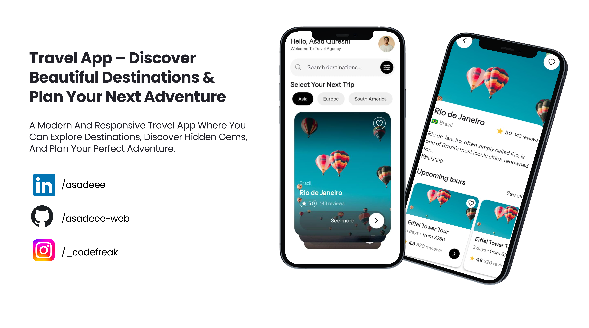

# 🌍 Travel App  

A beautiful **Flutter Travel App** where users can explore destinations with interactive swipe cards, search for places, and view detailed destination pages with smooth hero animations.  

---

## 🚀 Getting Started  

To get started with the project, clone the repository and run it locally:  

```bash
git clone https://github.com/asadeee-web/travel_app.git
cd travel_app
flutter pub get
flutter run
```

## 📱 Preview

Here’s a sneak peek of the app design:



---

## 📌 Features

 ✅ Explore amazing destinations

 ✅ Swipe through interactive travel cards

 ✅ Get a modern, smooth, and responsive UI

---

## 🛠️ Tech Stack

- **Flutter** (Frontend)  
- **Getx** (Navigation)  
- **Provider** (State Management)  
- **Dart** (Programming Language)  

---

## 🤝 Contributing

Contributions are welcome! Feel free to fork this repo and submit a PR.

---

